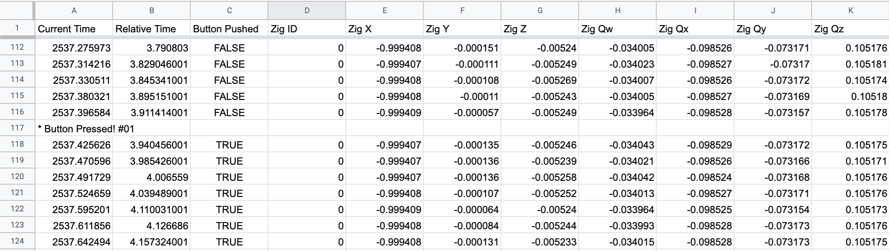
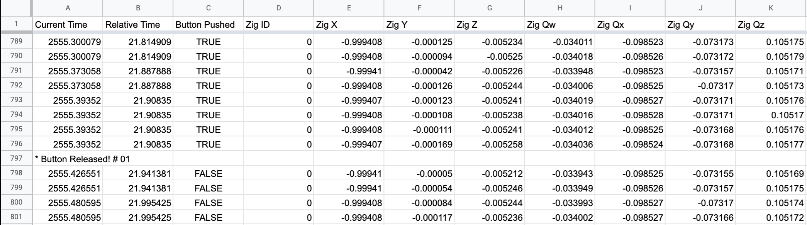
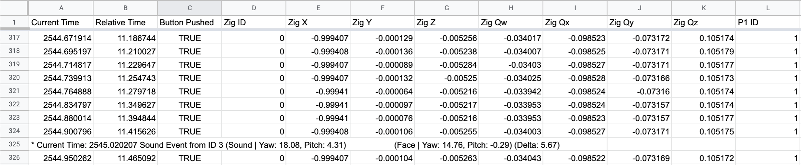
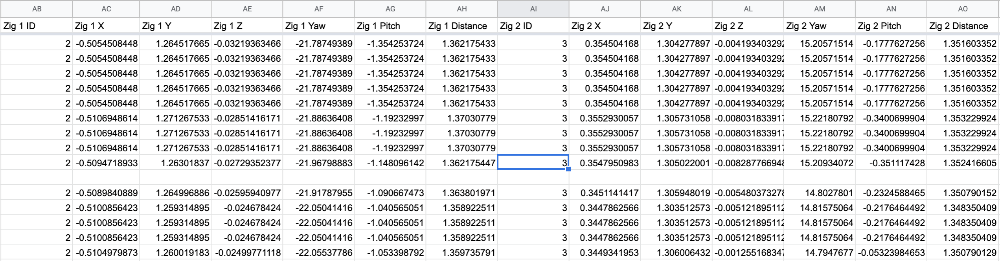

# Decode Soongsil Experiments

### HOWTO
1. Place .txt files in this directory
2. python main.py
3. .csv files will be created

### SAMPLES

Button pressed message

Button released message

Sound event form Person ID 3 (Zig)

### TODO

- [x] Change z and y coordinate from the zig.

- [x] Handles multiple .txt files at once.

- [ ] Check whether the coordinate is left handed frame or right handed.

- [x] Check sound event does not cause any decoding errors.

- [x] Add line breaking when a button event occurs.

### Discussion

- [ ] Git push current code into the Gitlab server.

- [ ] Check decision sampling rate (10Hz?).

- [ ] Check whether the coordinate is left handed frame or right handed.

- [ ] Check how Labview messages are written.

- [ ] Add another time stamp based on Labview local time.
